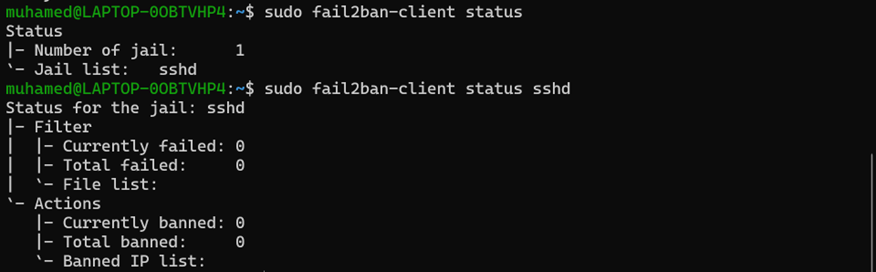

## Implementing a Firewall with IPTables on Linux

Project Description:

Set up and configure a basic firewall using IPTables on a Linux server. This project involves configuring basic and advanced IPTables rules, including NAT and port forwarding, and setting up logging and monitoring.

## 1. Install and Configure IPTables
   
Before I can use IPTables to manage network traffic, I need to ensure it’s installed on your system. Basic configuration involves setting default policies to control traffic flow and establishing rules to allow necessary connections while blocking unwanted traffic.

## 1.2 Basic Configuration of IPTablesCommands:
In this project, I configured a basic set of iptables rules to secure a Linux system. IPTables is a powerful firewall tool that allows for packet filtering and network address translation in Linux. The following commands were used to establish a baseline firewall configuration, which ensures that only specific types of traffic are allowed while everything else is blocked. This configuration is essential for protecting a system from unauthorized access and potential attacks.

1.	The first set of commands flushes (clears) all existing rules from the iptables chains, ensuring a clean state.
2.	The policy commands set the default behavior for incoming (INPUT), forwarding (FORWARD), and outgoing (OUTPUT) traffic.
3.	Specific rules are then added to allow established and related connections, local traffic on the loopback interface, and SSH connections on port 22.
4.	Finally, the configuration is saved so that it persists across reboots.
This set of commands forms a foundational firewall setup that can be expanded based on specific network security requirements.

## 2. Implement Advanced Rules
Advanced IPTables rules involve configuring Network Address Translation (NAT) to enable multiple devices to share a single public IP address, setting up port forwarding to allow external access to internal services, and applying traffic shaping to manage bandwidth and performance.

## 2.1 NAT (Network Address Translation) Configuration

NAT allows multiple devices on a local network to share a single public IP address. The MASQUERADE rule ensures that outgoing traffic from the internal network appears to come from the server’s public IP address, which is essential for internet access.

## 2.2 Port Forwarding Configuration

Port forwarding directs traffic from a specific port on the firewall to an internal IP address, making internal services accessible from the outside world. This is useful for services like web servers. In this case, incoming HTTP traffic on port 80 is forwarded to an internal server.

## 3. Set Up Logging and Monitoring
Logging and monitoring are crucial for identifying and responding to potential security issues. By enabling logging, you can track network traffic and troubleshoot issues. Fail2Ban provides automated protection by blocking suspicious IP addresses, and monitoring tools help analyze logs.

## 3.1	Logging IPTables Events

Logging IPTables events helps in tracking and analyzing network traffic and potential security issues. By logging dropped packets, you can review and understand why certain traffic is being blocked, which aids in troubleshooting and refining firewall rules.

## 3.2 Install and Configure Fail2Ban

Fail2Ban adds an additional layer of security by automatically blocking IP addresses that exhibit suspicious behavior, such as repeated failed login attempts. This helps prevent brute-force attacks and unauthorized access attempts.

Fail2Ban Configuration (jail.local)

The jail.local file is where I configure how Fail2Ban behaves, such as specifying which services to protect and setting the ban time for blocking IP addresses. To edit this file in the nano text editor, I follow these steps:

•	Manually Create the Directory: If the /etc/fail2ban/ directory does not exist, I can create it manually.
•	Create the jail.local File: After creating the directory, I can then create the jail.local file.
•	Edit in Nano Text Editor: I open the jail.local file in the nano text editor to configure Fail2Ban.

sudo nano /etc/fail2ban/jail.local: This opens the Fail2Ban configuration file (jail.local) in the nano text editor. The jail.local file is where I can configure how Fail2Ban behaves, such as setting which services to protect and the ban time for blocking IP addresses.

sudo systemctl start fail2ban: This starts the Fail2Ban service, making it actively monitor the system for malicious activity according to the configuration settings.
sudo systemctl enable fail2ban: This enables the Fail2Ban service to start automatically at boot time, ensuring that the protection is always active even after the system is restarted.

## 3.3 Monitor Logs with Fail2Ban

Monitoring Fail2Ban’s status ensures that it is working correctly and provides insights into any banned IP addresses. This helps verify that your firewall and security rules are effective and provides additional protection against potential threats.

 

